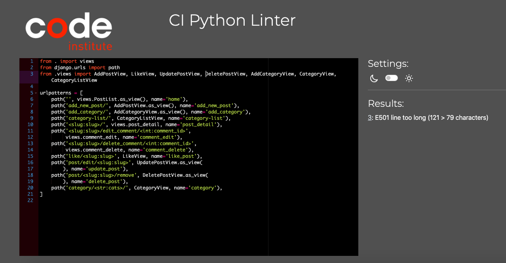

# Debbie's Recipe Blog

Here's my deployed link https://debbies-blog-9734dd06035e.herokuapp.com/ 

Table of contents
1. UX
2. Agile Development
3. Features implemented
4. Features Left to Implement
5. Technology used
6. Testing 
7. Validating, errors and bugs
8. Deployment
9. Resources
10. Credits and acknowledgements

1. UX
    Database planning
        Data structure
        Data models
    Design
            Site user
            Wireframes
            Color palette, fonts
            Goals for the website

2. Agile Development
    Overview
    User Stories

3. Features implemented
    - Navbar
        - Toggle down in small sizes
    - Home page with the latest post highlighted on top
    - Pagination system
    - Category system to categorize posts
    - Category page (toggle down menu from some of)
    - User can register, log in, and log out
    - Authenticated user can like and unlike posts
    - Authenticated user can comment, read, delete and update their comments
    - Superuser has front end CRUD for posts
        - Create new post page with rich text field
        - Edit post page with rich text field
        - Read posts
        - Delete posts
    - Superuser can add new post categories
    
4. Features Left to Implement
With more time, these would have been, among others, some  good additions to the project. 
    - Password change for users
    - Possibility for users to reply to a comment thread (not just posting new comment but as a reply to a specific comment)
    - Possibility to up- and downvote comments
    - Possibility to assign multiple categories to one post (i.e. cake can be dessert and snack)
    - A save function for users to save favorite recipes
    - Dropdown category menu in navbar implemented in all pages (right now it's not, even though categories are 
      accessible through the category list page from any page)
    - Admin's ability to delete or edit categories from front end
    - Admin's ability to approve or discard comments from front end

5. Technology used
    - Html - for page structure
    - CSS - for custom styling
    - Python - for the backend
    - Javascript - for handling comments
    - Django - framework used to build this blog
    - Bootstrap 5.01 - front end framework used to style this project 
    - Elephant SQL - used as the database
    - Font Awesome - for social media icons
    - Google Fonts- currently only for the hero image font
    - GitHub - for storing the code and for the project's Kanban board
    - Heroku - for hosting and deployement of this project
    - Cloudinary - hosting the static files
    - Git - version control tool  
    - Gitpod - IDE used for building this project
6. Testing
    Responsiveness
    ## Manual testing
    ### Account Registration Tests - PASSED
    - User can create profile	 
    - User can log into profile	 
    - User can log out of profile	 

    ### User Navigation Tests - PASSED
    - User can easily navigate to individual posts
    - User can easily navigate to category menu	 
    - User can access About page	 
    - User can submit a message in contact form in About page 
    - User can like and unlike posts when registered
    - User can comment on posts when registered
    - User can access the footer's social media links, which open in a new tab
    - Authenticated user can delete and edit their comments 
    - SuperUser can access add new post page, edit and delete post pages, add category page
    

    ### Account Authorisation Tests - PASSED
    - Only Superuser can access admin page	 
    - Non authorised user book a table	 
    - Non authorised user won't access profile page	 

    ### Admin Tests - PASSED
    - Items display correctly on front-end when updating post	 
    - Items display correctly on front-end when adding new post	
    - Items display correctly on front-end when deleting post	 
    - Items display correctly on front-end when adding category

    
7. Validating, errors and bugs

    ## Validating and errors

    ### HTML
    I validated my HTML by copying and pasting the "source code" from the app's deployed link. I got some errors pertaining my base.html that I could not fix, indicating that <li> tags in my navbar were not supposed to be under 
 and that there were "a" stray tags. 
    Nevertheless, the structure of my html is in principle  correct and trying to change my code according to these error messages caused the links in my navbar to look bad, and showed other errors instead. so I had to change the code back.

    
    

    ## CSS 

    The style.css file came back with no errors.
    

    ## Python

    The files I have coded in, that is, models.py, urls.py, views.py and admin.py are error free, except a line that is too long in my urls.py. I tried to correct his but then the terminal wouldn't open the browser, even though the Python linter indicated that that was the correct code. 
    

    ## JS

    The only javascript file in my project, handling the comments, is not coded by me, it is code included in the Code Institute's walkthrough. The JS Hint did not indicate the presence of errors. 

## Bugs

8. Deployment
9. Resources
    - Slack
    - Tutor assistance
10. Credits and acknowledgements
    - "I think therefore I blog" walkthrough project by Code Institute.
    - Readme inspired in this project : https://github.com/TulaUnogi/cat-beans-cafe/blob/main/README.md
    - Recipe pictures and about pictures: unsplash
    - Tutorial series 1  https://www.youtube.com/watch?v=k_RY1og4Zj0&list=PLOLrQ9Pn6cawWd-5UZM6CIm0uqFXeBcTd
    - Tutorial series 2 https://www.youtube.com/watch?v=sBjbty691eI&list=PLXuTq6OsqZjbCSfiLNb2f1FOs8viArjWy 
    - Tutorial series 3 https://www.youtube.com/watch?v=Mezody4yiXw&list=PLVBKjEIdL9bvCdI4l1Emvbezv10GjUaLk 
    - Tutorial series 4 https://www.youtube.com/playlist?list=PLCC34OHNcOtr025c1kHSPrnP18YPB-NFi 
    - Tutorial series 5 https://www.youtube.com/watch?v=rHux0gMZ3Eg 

