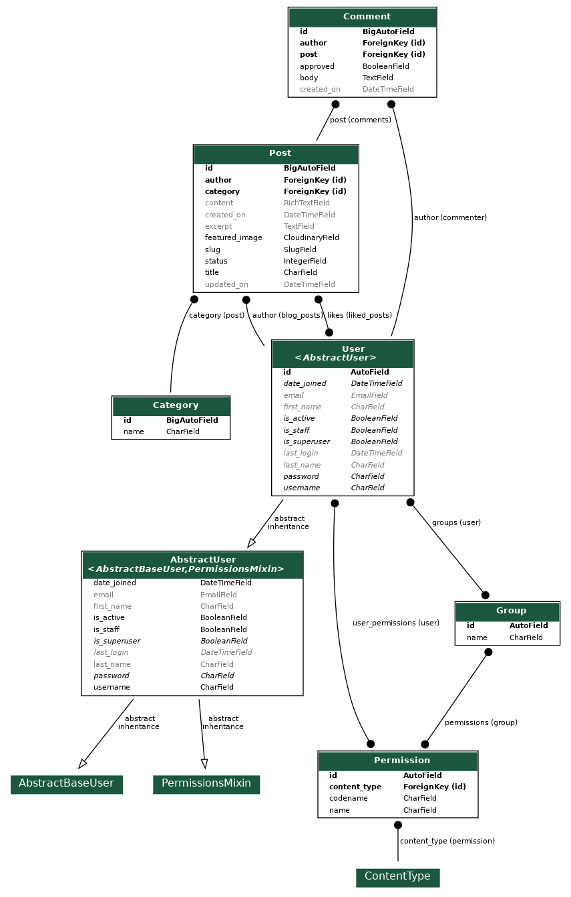
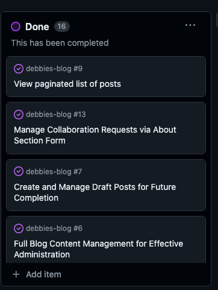
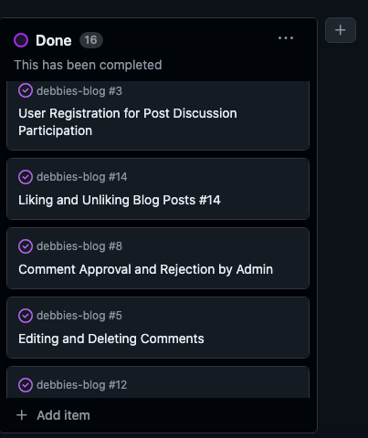
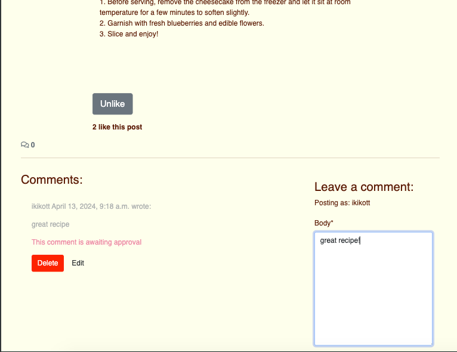
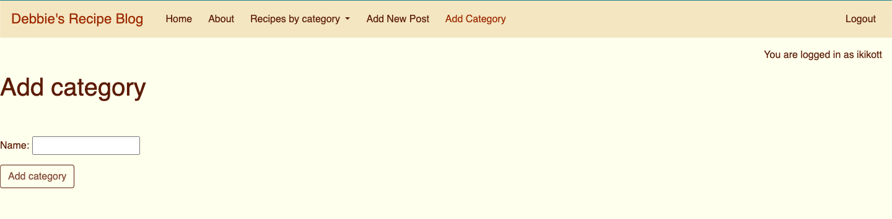

# Debbie's Recipe Blog

Deployed link:  https://debbies-blog-9734dd06035e.herokuapp.com/ 

Table of contents
 1. UX
 2. Agile Development
 3. Features 
 4. Technologies used
 5. Testing 
 6. Validating, errors and bugs
 7. Deployment
 8. Resources, credits and acknowledgements


 # 1. UX
### ERD


### Design
#### Site User
Debbie's Recipe Blog is a website for users of any age who like to cook and seek inspiration for plant-based recipes. Debbie is the imaginary persona who is the owner of this blog, and the author of all the recipes. 

#### Goals for the website
The goal for the website is to provide plant based recipes in a simple yet visually appealing format, providing the possibility to interact with the author and other users through likes, comments and the collaboration contact form.
 
#### Wireframes
See below part of the initial planning for the blog, a simple sketch of the home page, about page and sign up form in different screen sizes.


#### Color palette, font
The color palette of beiges and browns has been chosen to convey a simple, clean but also warm appearance to the blog. The beige and brown tones are warm but subtle enough that they don't overpower visually together with the colorful recipe pictures. The font, "Raleway", has been chosen to give a clean and elegant appearance to the site.

# 2. Agile Development
## User Stories
Throughout the development process, Agile methodologies have been applied to ensure adaptability to the evolving project needs. While partially planning and creating user stories offline since pen and paper work best for me, I have used GitHub's Kanban board for task management and updates, and all the user stories can be found there. This mix of different tools is what has worked best for me to adapt and re-think features during the process. Some of the user stories are sourced or inspired from Code Institute's own Django walkthrough project, and I progressively added my own as the project took more shape and its needs evolved. 

See the Kanban board with my user stories [here](https://github.com/users/Ikayherce/projects/4/views/1 )  






# 3. Features 
## Features implemented
#### - Navbar (toggle down in small sizes)
###### Note: the dropdown category menu is not displayed in the navbar from all pages, for instance the login and logout and the about page. When that is the case, the user can still access the posts displayed by categories in the category page. See more info below in the categories feature. 


#### - Home page with the latest post highlighted on top
###### Note: see the home page in different sizes under "testing responsiveness" 
#### - Pagination system to navigate the rest of the post list pages


#### - Post page for each post with comment field and likes displayed for all users
#### - Authenticated user can like and unlike posts



#### - Authenticated user can comment, read, delete and update their comments


#### - Message displays while awaiting for admin approval of the comment. 


#### - About page with collaboration form 


#### - Category system to categorize posts
###### Note: the dropdown category menu is not displayed in the navbar from all pages, for instance the login and logout and the about page. When that is the case, the user can still access the posts displayed by categories in the category page.


#### - Category page 


#### - User can register, log in, and log out


#### - Superuser has front end CRUD for posts


#### - Admin can delete posts


#### - Admin can edit post page with rich text field


#### - Admin can create new post page with rich text field

#### - Superuser can add new post categories
    

### - Admin panel
    

#### - Admin can approve comments before they are displayed
    

#### - Admin can edit or delete categories
    

#### - Admin can edit the about page and read collaboration requests submitted by users on the about page 
    


## Features Left to Implement
With more time, these would have been, among others, some  good additions to the project. 
- Password change for users on front end and user e-mail verification upon registration
- Possibility for users to reply to a comment thread (not just posting new comment but as a reply to a specific comment)
- Possibility to assign multiple categories to one post (i.e. cake can be dessert and snack)
- Dropdown category menu in navbar implemented in all pages (right now it's not, even though categories are 
    accessible through the category list page from any page)
- Admin's ability to delete or edit categories, approve comments and read collab requests from front end
- Subscribing model - possibility for users to get notified when new posts are up

# 4. Technologies used
- Html - for page structure
- CSS - for custom styling
- Python - for the backend
- Javascript - for handling comments
- Django - framework used to build this blog
- Bootstrap 5.01 - front end framework used to style this project 
- Elephant SQL - used as the database
- Font Awesome - for social media icons
- Google Fonts- currently only for the hero image font
- GitHub - for storing the code and for the project's Kanban board
- Heroku - for hosting and deployement of this project
- Cloudinary - hosting the static files
- Git - version control tool  
- Gitpod - IDE used for building this project

# 5. Testing
## Reponsiveness
Responsiveness has been achieved mainly through the use bootstrap classes. See below examples of different pages in all screensizes that I took screenshots of using https://ui.dev/amiresponsive 


 
## Manual testing
### Account Registration Tests - PASSED
- User can create profile	 
- User can log into profile	 
- User can log out of profile	 

### User Navigation Tests - PASSED
- User can navigate to individual posts
- User can navigate to category menu	 
- User can access About page	 
- User can submit a message in contact form in About page 
- User can like and unlike posts when registered
- User can comment on posts when registered
- User can access the footer's social media links, which open in a new tab
- Authenticated user can delete and edit their comments before they are approved by admin
- SuperUser can access add new post page, edit and delete post pages, add category page

### Account Authorisation Tests - PASSED
- Only Superuser can access admin page 
- Only Superuser can access front end admin features: add post, edit post, delete post, add category
- Only registered users can like and comment on posts

### Admin Tests - PASSED
- Items display correctly on front-end when updating post	 
- Items display correctly on front-end when adding new post	
- Items display correctly on front-end when deleting post	 
- Items display correctly on front-end when adding category

    
# 6. Validating, errors and bugs
## Validating and errors

### HTML
I validated my HTML by copying and pasting the "source code" from the app's deployed link. I got some errors pertaining my base.html that I could not fix, indicating that "li" tags in my navbar were not supposed to be under "div" and that there were "a" stray tags. 
Nevertheless, the structure of my html is in principle  correct and trying to change my code according to these error messages caused the links in my navbar to look bad, and showed other errors instead. so I had to change the code back.


### CSS 
The style.css file came back with no errors.


### Python
The files I have coded in, that is, models.py, urls.py, views.py and admin.py are error free.

### JS
The only javascript file in my project, handling the comments, is not coded by me, it is code included in the Code Institute's walkthrough. The JS Hint did not indicate the presence of errors. 

### Rich text field terminal message
When installing the rich text field CK Editor there were not any issues, but later on I started getting a terminal warning everytime I ran the server, saying that I should upgrade to CK Editor 5 or a paid plan. When I tried to install CK Editor 5 instead, I got another warning saying it wasn't compatible with the version of Django I was using. So I am still using CK Editor, it is not causing any issues so far despite the error message but I might have switched to another rich text field if I had had more time.


### Bugs
Sometimes while inspecting in devtools and looking at middle-sized and smaller screen sizes the container looks funny, but it doesn't happen looking at the website from the phone screen. If I had had more time I would have look at this further.


## Deployment

The steps to deploy this website to Heroku are based on Code Institute's blog walkthrough project, as described below.

### 1. Create the Heroku App:
- Sign up or log in to Heroku.
- Go to the Heroku Dashboard and click on **"New"** -> **"Create New App"**.
- Name your project, in my case "Debbie's Blog".
- Choose your region (e.g., EU).
- Click **"Create App"**.

### 2. Set Up Environment Variables:
- Create a file named `env.py` in the top level of your Django app.
- Import `os` in `env.py`.
- Set the necessary environment variables:
  - Set the secret key using: `os.environ['SECRET_KEY'] = 'your secret key'`.
  - For the database variable, use: `os.environ['DATABASE_URL'] = 'Paste the database link in here'`.
- In `settings.py`, replace the value of the `SECRET_KEY` variable with `os.environ.get('SECRET_KEY')`.
- Change the value of the `DATABASES` variable to:

  ```python
  'default': dj_database_url.parse(os.environ.get("DATABASE_URL"))
  ```

### 3. Configure Heroku:
- Navigate to the **"Settings"** tab in Heroku.
- Open the **"Config Vars"** section and add:
  - `DATABASE_URL` as Key and the database link from your app's `env.py` as Value.
  - `SECRET_KEY` as Key and the secret key value from `env.py` as Value.

### 4. Migrate Models:
- In the terminal, run migrations to apply the models to the new database connection.

### 5. Configure Static Files:
- In `settings.py`, add the following static files settings:

  

- Change the templates directory to:

  ```python
  TEMPLATES_DIR = os.path.join(BASE_DIR, 'templates')
  ```

- Update the `DIRS` key in the `TEMPLATES` variable to look like this:

  ```python
  'DIRS': [TEMPLATES_DIR]
  ```

### 6. Update ALLOWED_HOSTS:
- Add your Heroku app's domain to the `ALLOWED_HOSTS` list (e.g., `your-app-name.herokuapp.com`).

### 7. Create Necessary Directories and Files:
- If not already done, create top-level folders named `static` and `templates`.
- Create a `Procfile` with the following content:

  ```bash
  web: gunicorn PROJECT_NAME.wsgi
  ```

### 8. Final Steps:
- In the terminal, add the changed files, commit, and push to GitHub.

### Cloning the Application and Running it Locally

To run the application locally, follow the steps below:

1. **Clone the Repository:**
   - Open your terminal.
   - Navigate to the directory where you want to clone the project.
   - Run the following command:

     ```bash
     git clone https://github.com/your-username/your-repository-name.git
     ```

2. **Create and Activate a Virtual Environment:**
   - Navigate to the cloned repository:

     ```bash
     cd your-repository-name
     ```

   - Create a virtual environment:

     ```bash
     python3 -m venv venv
     ```

   - Activate the virtual environment:
     - On macOS/Linux:

       ```bash
       source venv/bin/activate
       ```

     - On Windows:

       ```bash
       venv\Scripts\activate
       ```

3. **Install Dependencies:**
   - Install the required packages using pip:

     ```bash
     pip install -r requirements.txt
     ```

4. **Set Up Environment Variables:**
   - Create a file named `env.py` in the project directory.
   - Inside `env.py`, add your environment variables, e.g.:

     ```python
     import os

     os.environ['SECRET_KEY'] = 'your-secret-key'
     os.environ['DATABASE_URL'] = 'your-database-url'
     ```

5. **Apply Migrations:**
   - Run the following command to apply migrations:

     ```bash
     python manage.py migrate
     ```

6. **Run the Application:**
   - Start the development server:

     ```bash
     python manage.py runserver
     ```

   - Open your browser and go to `http://127.0.0.1:8000/` to view the application.

7. **Deactivate the Virtual Environment:**
   - When you are done, deactivate the virtual environment:

     ```bash
     deactivate
     ```

# 8. Resources, Credits and acknowledgements
### The code
- "I think therefore I blog" walkthrough project by Code Institute 
- Tutorial series 1  https://www.youtube.com/watch?v=k_RY1og4Zj0&list=PLOLrQ9Pn6cawWd-5UZM6CIm0uqFXeBcTd
- Tutorial series 2 https://www.youtube.com/watch?v=sBjbty691eI&list=PLXuTq6OsqZjbCSfiLNb2f1FOs8viArjWy 
- Tutorial series 3 https://www.youtube.com/watch?v=Mezody4yiXw&list=PLVBKjEIdL9bvCdI4l1Emvbezv10GjUaLk 
- Tutorial series 4 https://www.youtube.com/playlist?list=PLCC34OHNcOtr025c1kHSPrnP18YPB-NFi 
### The user stories
- Partially sourced from the "I think therefore I blog" walkthrough project by Code Institute
### The README
- Readme inspired in this project : https://github.com/TulaUnogi/cat-beans-cafe/blob/main/README.md
### The pictures
- All pictures, both for the recipes and the about page, have been sourced from unsplash.com 
### The text of the recipes
- The text of the recipe posts has been created with the assistance of AI (Chat GPT). 
### Other resources
- Slack: fellow students at the Swedish Community channel have helped me with troubleshooting when it comes to bootstrap styles, padding and media queries.
- Tutor assistance: some of Code Institute's tutors have helped identify and solve errors along the process. 
